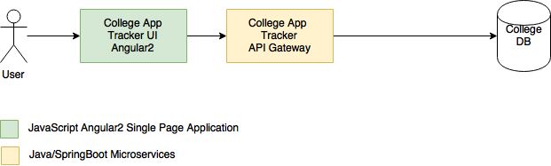
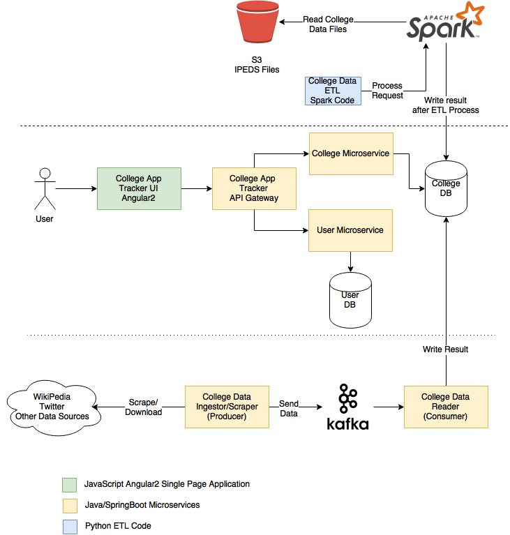
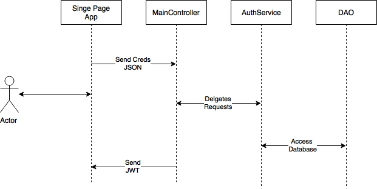

# College App Tracker

## Summary
The College App Tracker helps students with their college applications.  

### Current state


### Future state


* College Data from IPEDS is uploaded to S3.  A Spark job will run that will perform ETL on the college data and write the results to the College Database.
* College Data can also come from other sources besides DOE.  There are college data that can from Twitter, Wikipedia, etc.  For those sources we will create an ingestor and a scraper.  The ingestor will send data to Kafka.
* There is a process that consumes the college data from Kafka.  That consume information will then be written to the College DB.
* To provide meaning college information to students and parents of college bound students,  we need a way to display that information to them.  To do so, we will use a Single Page Application that talks to College API Gateway.  The API Gateway will then delegate calls to the College and User Microservices.


## Installation
This is a Spring Boot Gradle project that interfaces with a PostgreSQL database in the backend. Before you can run the application, you must first create and initialize the database. You will also need to update env.current file with the database (postgres) credential.

```
$ source env.current
$ gradle initdb initschema flywayMigrate -i
```

Note: You will need to update the PG_USER and PG_PASSWORD setting to your own.

After a successful initialization process, you should be able login to your database using the following credentials:

jdburl = jdbc:postgresql://localhost:5432/college
user = tracker_user
password = tr@ck3r_u53r

## Building and Running the application

```
$ gradle assemble
$ java -jar build/libs/college-app-tracker.jar
```

Upon a successful run, you can access the Swagger documentation page by going to http://localhost:8080/swagger-ui.html.  Additionally, the DB migration scripts will run courtesy of Flyway.  The DB migration scripts will create the tables needed by the application as well as populate them.

## What's in the application

### Spring Boot Dependencies

This application uses the following Spring Boot dependencies:

```
    compile("org.springframework.boot:spring-boot-starter-jdbc:${springBootVersion}"){
        exclude module: 'tomcat-jdbc'
    }
    compile("org.springframework.boot:spring-boot-starter-web:${springBootVersion}"){
        exclude module: 'spring-boot-starter-tomcat'
    }
    //use jetty
    compile("org.springframework.boot:spring-boot-starter-jetty:${springBootVersion}")
    compile("org.springframework.boot:spring-boot-starter-security:${springBootVersion}")
    compile("org.springframework.boot:spring-boot-starter-actuator:${springBootVersion}")

```

Note: Tomcat is replaced with Jetty.

### Connection Pool
The Tomcat JDBC connection pool is replaced by Hikari connection pool.
```
    compile("org.postgresql:postgresql:42.1.1")
    compile("com.zaxxer:HikariCP:2.6.3")
```

### Describing the API
Since this application exposes RESTful endpoints as API, we need a way to describe the API's.  For that, we choose Swagger.

```
    compile("io.springfox:springfox-swagger2:2.7.0")
    compile("io.springfox:springfox-swagger-ui:2.7.0")
```

### Authentication and Authorifation using JSON Web Tokens (JWT) and Spring Security
This application is stateless.  In order to maintain state between the client (browser, mobile), we need a way to hold the state information.  In this application, we chose JWT. The JWT will be generated in the server and will be passed to the client.  Because some of the endpoints will be protected,, the client will need to pass the JWT as a Bearer in the header request every time it communicates back to the server.  The server will extract the JWT from the header request and use it to authorize the request.

To determine which endpoints are protected or not, the following endpoint patterns are defined in the SecurityConfig.groovy.

```
    String[] swaggerPatterns =[
        "/v2/api-docs",
        "/configuration/ui",
        "/swagger-resources",
        "/configuration/security",
        "/swagger-ui.html",
        "/webjars/**",
        "/swagger-resources/configuration/ui",
        "/swagge‌​r-ui.html"
    ]
    String[] collegeTrackerAppAllowedPatterns = [
        "/api/apptracker/v1/login",
        "/health",
        "/info"
    ]

    /*
    Protected endpoints
    */
    String[] collegeTrackerAppAuthenticatedPatterns = [
            "/api/apptracker/v1/whoami",
            "/api/apptracker/v1/colleges",
    ]
    String[] allAllowed = [swaggerPatterns, collegeTrackerAppAllowedPatterns]

    @Override
    void configure(HttpSecurity http) throws Exception {
        http.authorizeRequests()
                .antMatchers(allAllowed).permitAll()
                .antMatchers(collegeTrackerAppAuthenticatedPatterns)
                .hasAuthority("ROLE_USER")
                .and()
                .addFilterBefore(jwtFilter, UsernamePasswordAuthenticationFilter.class)
                .exceptionHandling()

        http.cors().configurationSource(corsConfigurationSource())
        http.csrf().disable()
    }    
```

Since this application will be accessed from a Single Page Application using JavaScript (Angular2), we need to address the Same Origin Policy (SOP). In order to do that, we need to implement Cross-Origin Resource Sharing (CORS) in SecurityConfig.groovy.  This will allow our Angular2 App to communicate with the server.

```
    @Bean
    CorsConfigurationSource corsConfigurationSource() {
        CorsConfiguration configuration = new CorsConfiguration()
        UrlBasedCorsConfigurationSource source = new UrlBasedCorsConfigurationSource()

        configuration.setAllowCredentials(true)
        configuration.addAllowedOrigin("*")
        configuration.addAllowedHeader("*")
        configuration.setAllowedMethods(Arrays.asList("GET","POST", "PUT", "DELETE", "OPTION"))

        source.registerCorsConfiguration("/**", configuration)
        return source
    }
```

In the MainController.groovy, we define the Login API and generate the token that will be passed back to the client.  The client will then need to extract that JWT and store in the browser's local storage.  Every time the client interfaces with server API, the client will need to pass the JWT in the request header.
```
    @ApiOperation(value = "Authenticates a Student",response = String.class)
    @RequestMapping(method=RequestMethod.POST,value="/login", produces=MediaType.APPLICATION_JSON_VALUE)
    @ResponseBody
    ResponseEntity<String> login(@RequestBody LoginRequestData loginRequestData) {
        try {
            final def studentInfo = studentService.authenticate(loginRequestData.email, loginRequestData.password)
            def authToken = tokenUtil.generateStudentJwt(studentInfo)
            new ResponseEntity(new LoginResponseData(status: 'SUCCESSFUL',
                    token: authToken, student: StudentDto.create(studentInfo)), OK)
        }
        catch(ApplicationException e){
            new ResponseEntity(new ResultResponseData(status: 'ERROR', message: e.getMessage()), OK)
        }
    }
```

In order to validate and authorize every requests to a protected endpoint, we need to verify the token against the database.
In JwtFilter.groovy, we extract the JWT token from the HTTP Header.
```
    @Override
    void doFilter(ServletRequest request, ServletResponse response, FilterChain chain) throws IOException, ServletException {
        String token = tokenUtil.getToken((HttpServletRequest) request)
        if (token) {
            JwtAuthToken jwtToken = new JwtAuthToken(token)
            SecurityContextHolder.getContext().setAuthentication(jwtToken)
        }
        chain.doFilter(request, response)
    }
```

In JwtAuthenticationProvider.groovy, we validate the token against the database.
```
    @Override
    Authentication authenticate(Authentication authentication) throws AuthenticationException {
        try {
            String token = authentication.name
            Student student = studentService.getStudent(tokenUtil.decodeStudentJwt(token))
            JwtAuthenticatedProfile authProfile = new JwtAuthenticatedProfile(student)
            return authProfile
        }
        catch (Exception e){
            throw new ApplicationException("Failed to verify token", e)
        }
    }
```

### Controller, Service and DAO

This application follows the MVC design pattern.



## Running unit test
```
$ gradle test cobertura
```

To view the report go to build\reports\cobertura\index.html.

## Docker build
In order to build and push docker images, please login to [Dockerhub](http://www.dockerhub.com).
Make sure that you run `gradle assemble` before you do a Docker build.
```
$ docker build -t ealberto/college-app-tracker .
$ docker push ealberto/college-app-tracker
```

The docker image will have an nginx webserver that serves up the web assets.

## Running the entire application via Docker
The simplest way to spin up the entire application is to run all the components in Docker.  To do this, please refer to [college-app-tracker-docker](https://github.com/erwindev/college-app-tracker-docker) Github repo.


## Questions:
Send questions to Erwin Alberto (ealberto@me.com)
